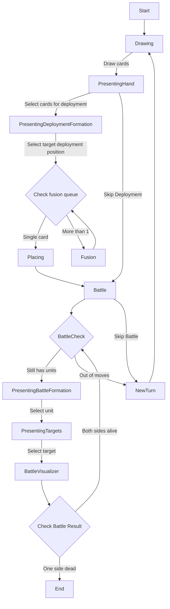

# battle flow

This gives an explaination to the flow of battle as implemented in `duelSlice.ts`.

Player's turn:

- `myCardsDrawed`: to get cards from `deck` to `reserves`
- display the `hand` or `reserves`
- `myReservesSelected`: select one or more cards by indices in `reserves`
- `myPlacingStarted`: start transition to the placement state, hide the `reserves` and show the `board` so the user can select the target placement on the board
- `myDeploymentTargetSelected`: set the target position, at this point we have all the cards used in this turn, form a fusion `queue`
- `myFused`: fuse the top 2 cards in the `queue`
- `fusionCompleted`: the fusion animation is completed (guessed with a timeout)
- repeat the last step as many as needed until the `queue` only have 1 card remaining
- `myPlaced`: finally place the card at the target position
- `myAttackStarted`:
  - start attacking phase,
  - mark all `forward` cards as haven't `acted`
  - move the `board` into focus and display stance indicator on the cards, this indicator has 2 options, depends on which get clicked will launch either of the next 2 actions
- `myStanceChangedToDefensive`: change the stance to `defensive`, this card won't be joining any attack this turn
- `myOffensiveCardSelected`: use this card for the attack, show indicator on the opponent's card so the player can select the target of the attack
- `myTargetCardSelected`: record the target card
- `myBattleStarted`: start battle animation, also calculate battle result before hand, remove the combatant cards from the board
- `battleEnded`: battle animation ended
- as long as there are cards which haven't `acted` this turn, move back to `myAttackStarted`
- `duelEnded`: when one side life reach 0

# Reworked

Duel's actions:

- drawing stage
  - select units for deployment
  - end drawing stage
- deploying stage
  - select deployment target
- battle stage
  - change unit stance
  - select unit for battle
  - select target unit
  - end battle stage
- surrender

Both the player and the AI will have to actively dispatch these actions to advance their turn. The player will do it via browser's input while the AI will dispatch them via the AI processing.

# Flowchart

Powered by [https://mermaid.live/]

